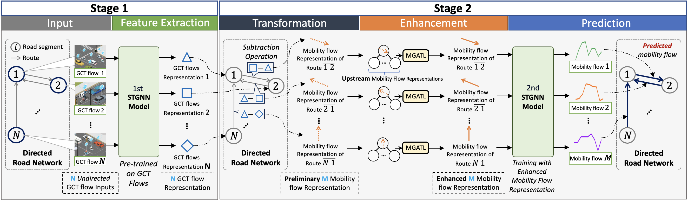

# Pre-trained STGNN & Framework

## Pre-trained STGNN (Stage 1):
### using historical GCT to predict future GCT flow (for feature extraction) 


## Framework (Stages 1+2): 
### using the extracted features from Pre-trained STGNN, then refined them and predict mobiltiy flows (for the main purpose)



This is a Pytorch implementation of the proposed 2-stage STGNN framework.

## Data Preparation

- The original CSV file for GCT flow is available at: [GCT flow.csv](../data/Raw/merged_GCT.csv)
- The original CSV file for Mobility flow is available at: [Mobility flow.csv](../data/Raw/merged_mobility.csv)
- To generate the **train/val/test datasets** for each type of GCT flow as {train,val,test}.npz, please follow the [script](https://github.com/liyaguang/DCRNN/blob/master/scripts/generate_training_data.py),
using the CSV files provided above.

Here is an example:

### GCT flow
|        Date         | Road Segment 1 | ...  | Road Segment 34 | 
|:-------------------:|:--------------:|:--------------:|:--------------|
|         ...         |    ...         |    ...         |   
| 8/29 18:30 |  449        |  ...        |   244        |   
| 8/29 18:45 |  368        |  ...        |   225        |    
| 8/29 19:00 |  344        |  ...         |   247        |  
|         ...         |    ...         |    ...         |   

### Mobility flow
|        Date         |  1_to_2(edge 1) | ... | 34_to_32(edge 84) | 
|:-------------------:|:--------------:|:--------------:|:--------------:|
|         ...         |    ...         |    ...         |    ...         |    ...        |    ...        |    ...        |
| 8/29 18:30 |      24        |    ...        |   56        |
| 8/29 18:45 |        17         |     ...        |   51        |
| 8/29 19:00 |     38         |    ...        |   53        |
|         ...            |      ...        |   ...        |


#### How to Create

We split data in 7:2:1 for generating train/test/val data.

Run the [scripts](https://github.com/liyaguang/DCRNN/blob/master/scripts/generate_training_data.py) to generate the train/test/val dataset.

## Graph Construction
As the implementation is based on pre-calculated distances between road sections, we provided the CSV file with road section distances and IDs at: 
- GCT Flow: [Distance between connected road segments (in meters)](../data/GCT-flow/nodes_distance.txt). 
- The distance between Mobility Flows corresponds to the distance of their starting nodes, 
  based on: [GPS coordinates for each road segment ID](../data/Incoming_Flows/neighbors_manual_v7_rename.csv).

Run the [script](https://github.com/liyaguang/DCRNN/blob/master/scripts/gen_adj_mx.py) to generate the Graph Structure based on the "Road Section Distance" file provided above.

The `processed Graph Structure of Road Section Network` is available at: 
- GCT Flow: [road network structure file](../data/GCT-flow/adj_mat_input.pkl)
- Mobility Flow: - [road network structure file](../data/Mobility-Flow/adj_mat_input.pkl)


## Datasets for training
The **processed train/val/test data structures file** is available, 
- data structures file for GCT flow:
```
./data/v7_GCT_flow_34nodes_84edges
```

- data structures file for Mobility flow: 
```
./data/v7_Mobility_flow_34nodes_84edges
```

## Example trained Models

The trained models for Node-to-Node & Node-to-Edge task:

- Example trained Model for Node-to-Node Prediction (Stage1): [exp202308271352_3.pth](./model/save/exp202308271352_3.pth)
- Example trained Model for Node-to-Edge Prediction (Stage1+2): [exp202312032110_1.pth](./model/save/exp202312032110_1.pth)

## Model Training
For Node-to-Node Prediction(Stage1), please set in the:
```
./Pretraining_GCT_Flows
```
Put the pre-trained-well extractors model in:
```
./save
```

For Node-to-Edge Prediction(Stage1+2), please set in the:
```
./Training_Framework_Mobility_Flows
```
Put the pre-trained-well extractors model in:
```
./save
```

---

## Runnable Experimental Code
And put all codes together to run the training process.

Or directly run tasks' `Jupyter Notebook`:


[Runnable_Pre_Training.ipynb](./model/Pretraining_GCT_Flows/Runnable_Pre_Training.ipynb)


[Runnable_Framework.ipynb](./model/Training_Framework_Mobility_Flows/Runnable_Framework.ipynb)

